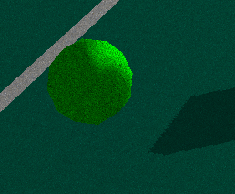
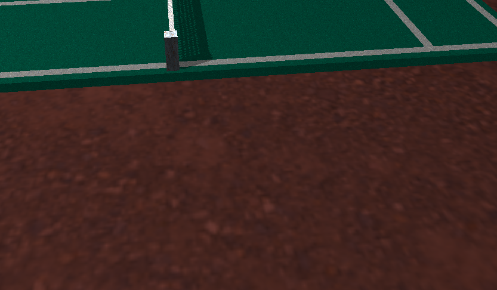
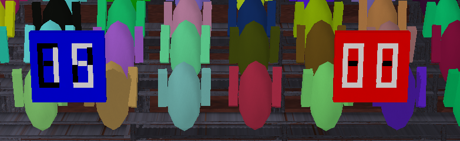

# COMP-371 Team 9 Project

<hr />

## Credits

- Jonah Ball id: 40178421
- Evan Greenstein id: 40173229
- Matthew Segal id: 40031839
- Sabrina Kim id: 40066662
- Jonathan Miller id: 40135070 (Separate Section CD)

## Description 

We chose to do a simple tennis game simulation. To achieve this, we created a simple animation, using keyframes,
of 2 players playing tennis against each other in front of a crowd.

The animation is non-interactive, except for camera controls.

The basic animation is as follows: The blue-side player scores on the red-side player. Then the red player scores on the blue player.
Finally, both players volley the ball back and forth for a while until the blue player finally scores.

Each time a player scores, their respective scoreboard increments an appropriate amount according to the rules of tennis.
In addition, a crowd sound plays, indicating cheering.

There is a constant murmur of crowd noise throughout the scene to make it more realistic.

The crowd sounds are composed of 2 male crowds and 2 female crowds. One side has the male crowd sounds and vice-versa.
When a player scores, a random crowd sound from their appropriate sound bank plays.

In addition, when a racket hits a ball, a random ball sound plays. There are 3 possible ball sounds.

## Controls

 - arrow left - Rotate the world about the positive X axis
 - arrow right - Rotate the world about the negative X axis
 - arrow up - Rotate the world about the positive Y axis
 - arrow down - Rotate the world about the negative Y axis
 - P - Render model as points
 - L - Render model as lines
 - T - Render model as triangles
 - Y - Toggle the camera to rotate in a fixed angle window 
 - HOME - Resets projection, view, world matrices to initial position
 - Mouse button left - Movement with left mouse button up/ down will tilt the camera
 - Mouse button right - Movement with right mouse button left/ right will pan the camera
 - Mouse Button Middle - Movement up/ down will zoom in and out the camera

## TODO for Project

- [x] Create simple tennis game animation
- [x] Add ball sounds when ball is hit
- [x] Add crowd sounds to cheer when player scores
- [x] Implement working scoreboard that increments appropriately when a player scores
- [x] Draw 2 rackets with arms representing the players
- [ ] Create video for project
- [x] Add screenshots to README 


## Possible Add-ons
- [x] Add animated crowd
- [x] Add foliage, including small shrubs, tall shrubs, and grass
- [x] Add walking people
- [x] Animate a camera
- [x] Added fireworks when the game is finished
- [ ] Add a clock to show animation duration

## Contributions

- Jonah: Animation and audio
- Matthew: Animation, audio, code cleanup, and documentation
- Sabrina: Modelling
- Jon: Modelling and animation
- Evan: Animation

## Screenshots

Here, we can see a sample moment in the animation, it looks like the blue player is winning:


The ball is green and has a grass-like texture to it:



The arms hold the racket with fingers that curl and uncurl automatically. Look at that cool glove:


There are lots of people watching the game. Can you hear their talking when you watch the animation?
The colors are all randomly-generated each time the animation is played


Here's another view from the bleachers


The field has a dirt-like texture and the court has a grass-like texture:



There are also 3 particularly enamoured fans near the court. They gradually walk around.
Their colors are also randomly-generated each time. This shot also showcases the ball bouncing:


The scoreboard increments in groups of 15 per tennis scoring rules. One side is the blue player, the other is the red player:



Here's the scene without any shadows:


Here's the scene without any textures:


Here's the scene without any shadows or textures:


And finally, here's a pretty cool angle you can get if you move the camera around with the arrow keys:


## Build Instructions

### Command Line

1. Download and Install CMake
2. Open a terminal
3. Run CMake:

```shell
cd <source_folder>
cmake -S . -B cmake
cmake --build cmake --target install
```

To generate an XCode project from the command line use:

```shell
cd <source_folder>
cmake -S . -B cmake -G Xcode
cmake --build cmake --target install
```
